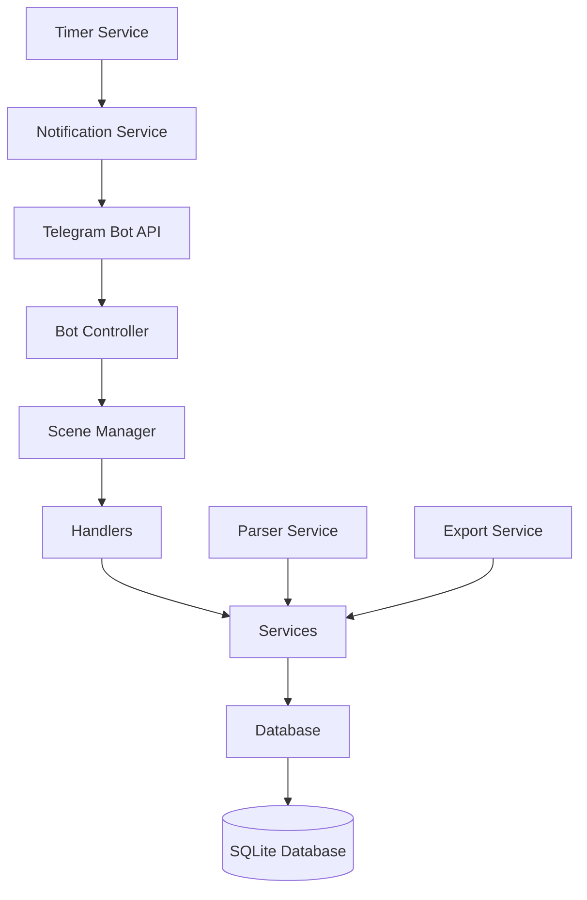
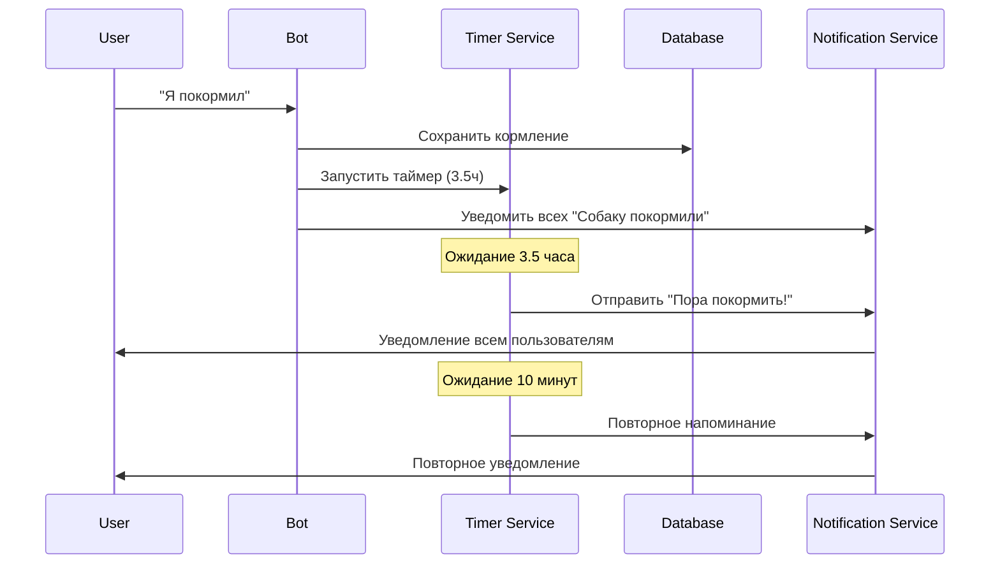
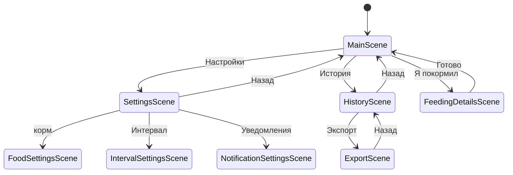

# Архитектура телеграм-бота для кормления собаки

## Технический стек

- **Node.js** + **TypeScript** - основная платформа разработки
- **Telegraf** - библиотека для работы с Telegram Bot API
- **SQLite3** - локальная база данных для хранения данных
- **dotenv** - управление переменными окружения
- **ts-node** - запуск TypeScript без компиляции

## Архитектурные принципы

### 1. Модульность
Каждый компонент системы изолирован в отдельном модуле:
- **Handlers** - обработка команд и кнопок
- **Services** - бизнес-логика
- **Database** - работа с данными
- **Utils** - вспомогательные функции

### 2. Состояния (FSM)
Использование Telegraf Scenes для управления состояниями:
- Каждый экран = отдельная сцена
- Переходы между сценами через контекст
- Сохранение состояния пользователя

### 3. Персистентность
- SQLite для надежного хранения данных
- Восстановление состояния после перезапуска
- Миграции схемы базы данных

## Структура базы данных

### Таблица `users`
```sql
CREATE TABLE users (
    id INTEGER PRIMARY KEY AUTOINCREMENT,
    telegram_id INTEGER UNIQUE NOT NULL,
    username TEXT,
    notifications_enabled BOOLEAN DEFAULT 1,
    created_at DATETIME DEFAULT CURRENT_TIMESTAMP
);
```

### Таблица `feedings`
```sql
CREATE TABLE feedings (
    id INTEGER PRIMARY KEY AUTOINCREMENT,
    user_id INTEGER NOT NULL,
    timestamp DATETIME DEFAULT CURRENT_TIMESTAMP,
    food_type TEXT DEFAULT 'dry', -- 'dry' или 'wet'
    amount INTEGER DEFAULT 12,    -- граммы
    details TEXT,                 -- дополнительные детали
    FOREIGN KEY (user_id) REFERENCES users (id)
);
```

### Таблица `settings`
```sql
CREATE TABLE settings (
    key TEXT PRIMARY KEY,
    value TEXT NOT NULL,
    updated_at DATETIME DEFAULT CURRENT_TIMESTAMP
);
```

### Таблица `scheduled_feedings`
```sql
CREATE TABLE scheduled_feedings (
    id INTEGER PRIMARY KEY AUTOINCREMENT,
    scheduled_time DATETIME NOT NULL,
    is_active BOOLEAN DEFAULT 1,
    created_by INTEGER,
    created_at DATETIME DEFAULT CURRENT_TIMESTAMP,
    FOREIGN KEY (created_by) REFERENCES users (id)
);
```

## Основные компоненты

### 1. Bot Controller (`src/bot.ts`)
- Инициализация бота
- Регистрация middleware
- Запуск сцен
- Обработка ошибок

### 2. Database Service (`src/database/db.ts`)
- Подключение к SQLite
- CRUD операции
- Миграции схемы
- Транзакции

### 3. Timer Service (`src/services/timer.ts`)
- Управление таймерами кормления
- Отправка уведомлений
- Повторные напоминания
- Восстановление после перезапуска

### 4. Notification Service (`src/services/notifications.ts`)
- Фильтрация получателей
- Форматирование сообщений
- Массовая отправка
- Обработка ошибок отправки

### 5. Parser Service (`src/services/parser.ts`)
- Парсинг времени (1мин, 2ч, 2:15)
- Валидация ввода
- Парсинг деталей кормления
- Нормализация данных

## Диаграмма компонентов



## Диаграмма потока данных



## Управление состояниями

### Основные сцены:
1. **MainScene** - главный экран с 4 кнопками
2. **SettingsScene** - меню настроек
3. **FoodSettingsScene** - настройки корма
4. **IntervalSettingsScene** - настройки интервала
5. **NotificationSettingsScene** - настройки уведомлений
6. **FeedingDetailsScene** - уточнение деталей кормления
7. **HistoryScene** - просмотр истории
8. **ExportScene** - экспорт данных

### Переходы между сценами:


## Обработка ошибок

### Уровни обработки:
1. **Bot Level** - глобальный обработчик ошибок
2. **Scene Level** - обработка ошибок в сценах
3. **Service Level** - обработка бизнес-логики
4. **Database Level** - обработка ошибок БД

### Стратегии восстановления:
- **Retry** - повторные попытки для сетевых операций
- **Fallback** - резервные варианты для критических функций
- **Graceful Degradation** - частичная функциональность при ошибках
- **User Notification** - информирование пользователя о проблемах

## Безопасность

### Валидация данных:
- Проверка типов входных данных
- Санитизация пользовательского ввода
- Ограничения на размер данных
- Валидация временных интервалов

### Защита от злоупотреблений:
- Rate limiting для команд
- Валидация telegram_id
- Ограничения на количество пользователей
- Логирование подозрительной активности

## Производительность

### Оптимизации:
- Индексы в базе данных
- Кеширование настроек в памяти
- Батчинг уведомлений
- Ленивая загрузка истории

### Мониторинг:
- Логирование времени выполнения
- Отслеживание использования памяти
- Мониторинг ошибок
- Статистика использования функций
