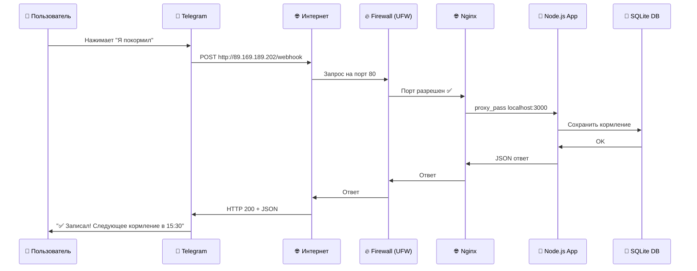

# Как работает это приложение (объяснение для дебила) 🤓

Представьте себе такую схему:

## 🌍 **Общая схема: кто кому делает запросы**

```
ПОЛЬЗОВАТЕЛЬ → TELEGRAM → YANDEX CLOUD VM → ПРИЛОЖЕНИЕ
     ↓              ↓           ↓               ↓
  Нажимает        Получает   Получает        Обрабатывает
   кнопку         сообщение   webhook         и отвечает
```

**⚠️ ГЛАВНОЕ:** Telegram **САМ** стучится к вашей виртуальной машине, а не наоборот!

---

## 🔄 **Два режима работы**

### **1. Webhook режим (PRODUCTION) - как работает сейчас:**

- Ваш бот говорит Telegram: "Когда будет сообщение, стучись сюда: `http://89.169.189.202/webhook`"
- Пользователь пишет боту
- Telegram **САМ** делает HTTP POST запрос на ваш сервер
- Ваш сервер отвечает Telegram'у, что делать

### **2. Polling режим (DEVELOPMENT):**

- Ваш бот **САМ** постоянно спрашивает у Telegram: "Есть новые сообщения?"
- Telegram отвечает: "Да, вот они" или "Нет"

---

## 🏗️ **Архитектура сервера (что происходит на VM)**

```
ИНТЕРНЕТ (порт 80/443)
       ↓
   🔥 FIREWALL (ufw)
       ↓ (разрешает порт 80)
   🌐 NGINX (порт 80/443)
       ↓ (проксирует на localhost:3000)
   🤖 NODE.JS ПРИЛОЖЕНИЕ (порт 3000)
       ↓
   💾 SQLITE DATABASE (файл на диске)
```

---

## 📡 **Путь запроса пошагово**

1. **Пользователь** нажимает кнопку в Telegram
2. **Telegram серверы** получают это действие
3. **Telegram** делает HTTP POST запрос на: `http://89.169.189.202/webhook`
4. **Yandex Cloud VM** получает запрос на порт 80
5. **UFW Firewall** проверяет - порт 80 разрешен ✅
6. **Nginx** получает запрос и смотрит конфиг:
    ```nginx
    location /webhook {
        proxy_pass http://127.0.0.1:3000;  # перенаправляет на приложение
    }
    ```
7. **Node.js приложение** на порту 3000 получает запрос
8. **Приложение** обрабатывает команду, записывает в SQLite
9. **Приложение** отвечает Telegram'у JSON'ом
10. **Telegram** показывает ответ пользователю

---

## 🔐 **Какие порты открыты и зачем**

| Порт     | Кто слушает | Зачем                      | Кто может достучаться        |
| -------- | ----------- | -------------------------- | ---------------------------- |
| **22**   | SSH         | Подключение для управления | Только вы (по ключу)         |
| **80**   | Nginx       | HTTP webhooks от Telegram  | Весь интернет                |
| **3000** | Node.js     | Приложение бота            | Только localhost (127.0.0.1) |

**💡 Важно:** Порт 3000 НЕ открыт для интернета! К нему может обращаться только Nginx изнутри сервера.

---

## 🛡️ **Где стоят файрволы и защита**

1. **UFW (Uncomplicated Firewall)** на VM:

    ```bash
    sudo ufw allow ssh    # порт 22
    sudo ufw allow 80     # порт 80
    # порт 3000 НЕ открыт!
    ```

2. **Yandex Cloud Security Groups** (сетевой уровень):
    - По умолчанию блокирует всё
    - Открывает только то, что нужно

3. **Nginx Rate Limiting** (защита от DDoS):
    ```nginx
    limit_req_zone $binary_remote_addr zone=webhook:10m rate=10r/s;
    ```

---

## 🚀 **Какие серверы задействованы**

1. **Telegram серверы** (api.telegram.org) - получают команды от пользователей
2. **Ваша VM в Yandex Cloud** (89.169.189.202) - обрабатывает webhooks
3. **Nginx** (веб-сервер) - принимает HTTP запросы и проксирует их
4. **Node.js процесс** (ваше приложение) - бизнес-логика
5. **SQLite файл** - база данных на диске VM

---

## ⚡ **Что происходит при развертывании**

Скрипт `deploy-yandex.sh` делает:

1. **Создает VM** в Yandex Cloud (2 CPU, 2GB RAM)
2. **Устанавливает** Node.js, Git, PM2
3. **Копирует** код приложения
4. **Настраивает** переменные окружения (.env)
5. **Открывает порты** в firewall (22, 80)
6. **Запускает** приложение через PM2
7. **Говорит Telegram'у** адрес webhook'а

---

## 🔧 **Если что-то сломалось:**

```bash
# Проверить статус
npm run status:yandex

# Посмотреть логи
npm run logs:yandex

# Перезапустить бота
pm2 restart dog-feeding-bot
```

**Простыми словами:** Telegram стучится к вашей машинке через интернет, Nginx пропускает только нужные запросы к приложению, приложение отвечает, что показать пользователю! 🐕

## 🔄 **Диаграмма полного потока данных**


