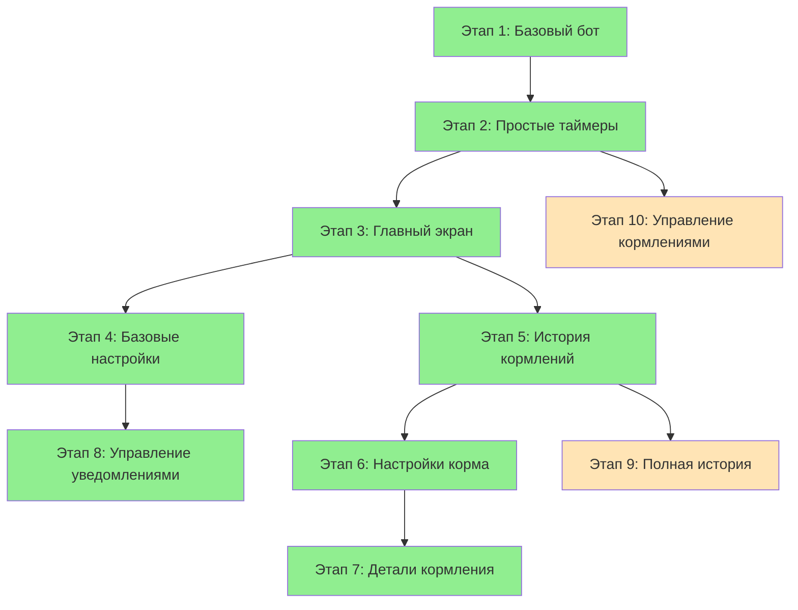

# Обзор всех этапов разработки

## Принципы MVP разработки

1. **Каждый этап = работающее приложение** - можно остановиться на любом этапе
2. **Инкрементальное усложнение** - от простого к сложному  
3. **Минимальные изменения** - каждый этап добавляет 1-2 новые функции
4. **Обратная совместимость** - новые этапы не ломают предыдущие
5. **Тестируемость** - каждый этап можно протестировать отдельно

## Этап 1: Базовый бот
**Статус**: ✅ Завершен  
**Время разработки**: 2-3 часа  
**Сложность**: Низкая

### Функциональность:
- ✅ Подключение к Telegram Bot API
- ✅ Команда `/start` с приветствием
- ✅ Кнопка "Я покормил"
- ✅ Уведомление всех пользователей о кормлении
- ✅ Хранение данных в памяти

### Файлы:
- `package.json`, `tsconfig.json`, `.env.example`
- `src/bot.ts` - основной файл бота
- `src/types.ts` - базовые типы
- `README.md` - инструкции

---

## Этап 2: Простые таймеры
**Статус**: ✅ Завершен  
**Время разработки**: 3-4 часа  
**Сложность**: Средняя

### Функциональность:
- ✅ Автоматические напоминания через 3.5 часа
- ✅ Повторные уведомления каждые 10 минут
- ✅ Кнопка "Завершить кормления на сегодня"
- ✅ Команда `/status` для проверки состояния

### Новые файлы:
- `src/services/timer.ts` - сервис таймеров
- `src/utils/constants.ts` - константы

### Изменения:
- `src/bot.ts` - интеграция с таймерами

---

## Этап 3: Главный экран
**Статус**: ✅ Завершен  
**Время разработки**: 2-3 часа  
**Сложность**: Средняя

### Функциональность:
- 4 кнопки главного экрана
- Система сцен (FSM)
- Навигация между экранами
- Заглушки для настроек и истории

### Новые файлы:
- `src/scenes/main.ts` - главная сцена
- `src/handlers/main.ts` - обработчики
- `src/utils/keyboards.ts` - клавиатуры

---

## Этап 4: Базовые настройки
**Статус**: ✅ Завершен  
**Время разработки**: 4-5 часов  
**Сложность**: Средняя

### Функциональность:
- Настройка интервала кормления
- Парсинг различных форматов времени
- Валидация ввода (1 мин - 24 часа)
- Применение настроек к таймерам

### Новые файлы:
- `src/scenes/settings.ts` - сцена настроек
- `src/services/parser.ts` - парсер времени
- `src/handlers/settings.ts` - обработчики

---

## Этап 5: История кормлений
**Статус**: ✅ Завершен  
**Время разработки**: 5-6 часов  
**Сложность**: Высокая

### Функциональность:
- SQLite база данных
- Сохранение истории кормлений
- Просмотр кормлений за сегодня
- Отображение следующего кормления

### Новые файлы:
- `src/database/db.ts` - работа с БД
- `src/database/schema.sql` - схема БД
- `src/scenes/history.ts` - сцена истории
- `src/handlers/history.ts` - обработчики

---

## Этап 6: Настройки корма
**Статус**: ✅ Завершен  
**Время разработки**: 3-4 часа  
**Сложность**: Средняя

### Функциональность:
- Выбор типа корма (сухой/влажный)
- Настройка количества (1-200г)
- Сохранение в БД
- Глобальные настройки для всех

### Новые файлы:
- `src/scenes/food.ts` - сцены корма
- `src/handlers/food-settings.ts` - обработчики

### Изменения:
- `src/database/schema.sql` - таблица settings

---

## Этап 7: Детали кормления
**Статус**: ✅ Завершен  
**Время разработки**: 4-5 часов  
**Сложность**: Средняя

### Функциональность:
- Экран успешного кормления
- Уточнение деталей кормления
- Парсинг деталей ("12 гр", "63 влажного")
- Обновление записи в БД

### Новые файлы:
- `src/scenes/feeding-details.ts` - сцена деталей
- `src/services/feeding-parser.ts` - парсер деталей
- `src/handlers/feeding.ts` - обработчики

---

## Этап 8: Управление уведомлениями
**Статус**: ✅ Завершен  
**Время разработки**: 3-4 часа  
**Сложность**: Средняя

### Функциональность:
- Персональные настройки уведомлений
- Включение/выключение для каждого пользователя
- Фильтрация получателей
- Сохранение в БД

### Новые файлы:
- `src/services/notifications.ts` - сервис уведомлений
- `src/handlers/notification-settings.ts` - обработчики

### Изменения:
- `src/database/schema.sql` - таблица users

---

## Этап 9: Полная история
**Статус**: Следующий этап  
**Время разработки**: 5-6 часов  
**Сложность**: Высокая

### Функциональность:
- Просмотр всей истории кормлений
- Экспорт в CSV формат
- Экспорт в HTML формат
- Пагинация для больших списков

### Новые файлы:
- `src/handlers/export.ts` - экспорт данных
- `src/services/export.ts` - генерация файлов
- `src/utils/formatters.ts` - форматирование

---

## Этап 10: Управление кормлениями
**Статус**: Финальный этап  
**Время разработки**: 4-5 часов  
**Сложность**: Высокая

### Функциональность:
- Отмена следующего кормления
- Создание кормления на точное время
- Сохранение расписания в БД
- Восстановление таймеров после перезапуска

### Новые файлы:
- `src/handlers/schedule.ts` - управление расписанием
- `src/services/scheduler.ts` - планировщик

### Изменения:
- `src/database/schema.sql` - таблица scheduled_feedings

---

## Диаграмма зависимостей этапов

**Легенда:**
- 🟢 Зеленый - завершен
- 🟡 Желтый - планируется в ближайшее время
- 🔴 Розовый - планируется позже

## Рекомендации по разработке

### Минимальный MVP (этапы 1-3): ✅ Завершен
- Базовая функциональность кормления
- Автоматические напоминания
- Удобная навигация

### Расширенный MVP (этапы 1-6): ✅ Завершен
- Добавляет настройки и историю
- Полноценная персонализация
- Готов к использованию

### Почти полная версия (этапы 1-8): ✅ Завершена
- Все основные функции
- Персональные настройки уведомлений
- Детали кормления
- Полнофункциональная система

### Полная версия (этапы 1-10): В разработке
- Все заявленные функции
- Экспорт данных
- Гибкое управление расписанием

### Порядок разработки:
1. **Последовательно** - каждый этап строится на предыдущем
2. **Тестирование** - обязательно тестировать каждый этап
3. **Документация** - обновлять README после каждого этапа
4. **Рефакторинг** - при необходимости улучшать код между этапами

## Оценка времени

| Этап | Время разработки | Время тестирования | Общее время |
|------|------------------|-------------------|-------------|
| 1    | 2-3 часа        | 1 час             | 3-4 часа    |
| 2    | 3-4 часа        | 1-2 часа          | 4-6 часов   |
| 3    | 2-3 часа        | 1 час             | 3-4 часа    |
| 4    | 4-5 часов       | 2 часа            | 6-7 часов   |
| 5    | 5-6 часов       | 2-3 часа          | 7-9 часов   |
| 6    | 3-4 часа        | 1-2 часа          | 4-6 часов   |
| 7    | 4-5 часов       | 2 часа            | 6-7 часов   |
| 8    | 3-4 часа        | 1-2 часа          | 4-6 часов   |
| 9    | 5-6 часов       | 2-3 часа          | 7-9 часов   |
| 10   | 4-5 часов       | 2-3 часа          | 6-8 часов   |

**Общее время**: 50-70 часов разработки

**Минимальный MVP (1-3)**: 10-14 часов  
**Расширенный MVP (1-6)**: 27-36 часов  
**Полная версия (1-10)**: 50-70 часов
