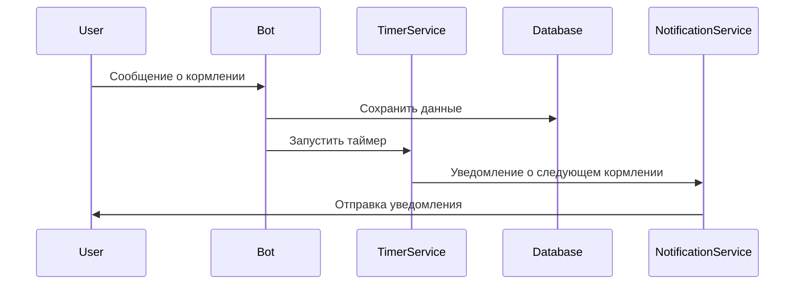

# Контекст продукта

Проект: The Dog Feed - телеграм бот для учета кормлений собаки.

## Основные цели:

- Упрощение отслеживания кормлений питомца
- Напоминания о времени кормления
- Анализ истории кормлений

## Ключевые функции:

- Запись времени и типа корма
- Настройка расписания кормлений
- Просмотр истории кормлений
- Уведомления владельцу
- Экспорт данных

## Технологический стек:

- **Backend**: Node.js + TypeScript
- **Framework**: Telegraf для Telegram Bot API
- **Database**: SQLite с таблицами:
    - `users` (телеграм ID, настройки уведомлений)
    - `feedings` (время, тип корма, количество)
    - `settings` (ключ-значение)
    - `scheduled_feedings` (расписания кормлений)
- **Infrastructure**: Yandex Cloud VM, PM2, Nginx
- **Utils**: dotenv, ts-node, SQLite3

## Архитектурные компоненты:

1. **Bot Controller** - инициализация бота, обработка команд
2. **Database Service** - CRUD операции, миграции БД
3. **Timer Service** - управление таймерами кормления
4. **Notification Service** - отправка уведомлений
5. **Parser Service** - обработка пользовательского ввода
6. **Scheduler Service** - управление расписаниями

## Диаграмма потока данных:

## Состояния бота (сцены):

- Главное меню
- корм
- Управление расписанием
- Просмотр истории
- Детали кормления
- Экспорт данных
